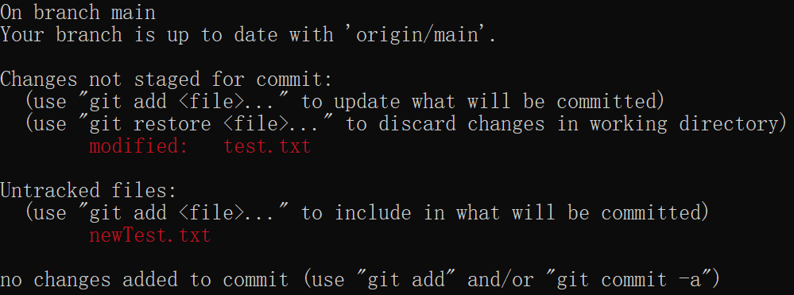

# CRUD Operation
{: .no_toc }

## Table of contents
{: .no_toc .text-delta }

1. TOC
{:toc}

---

## What is CRUD?
CRUD is an acronym which stands for Create, Read, Update and Delete. These are the basic functions that present in most storage system including Git.

As a modern source-code management software, Git makes CRUD simple and fast to perform.

## Creating New Remote Repository
In order to use Git to manage your files, you need to have a remote repository.

Follow instructions on this [page](https://docs.github.com/en/get-started/quickstart/create-a-repo) to create your GitHub repository.

## Linking Local Repository with Remote Repository
1. ***Open desired directory in Command Prompt***

   ```bash
   $ cd <PATH>
   ```

   Replace <PATH> with the path of your local directory. This line will open the specified directory.

   Instead of typing the path of the directory, you can also type cd, then drag the desired directory to Command Prompt.

2. ***Create a local Git repository***

   ```bash
   $ git init
   ```

   A local Git repository is a local directory with Git version control enabled.

3. ***Link your local and remote repository***

   ```bash
   $ git remote add origin <PATH>
   ```

   Replace <PATH> with the path of your remote repository.

4. ***Choose the main branch***

   ```bash
   $ git branch -m main
   ```

   Git also allows users to have branches for their repository. New repositories will start with one branch called main.

## Updating Remote Repository
Now that your repository is created and setup, Git will start tracking any changes made within your local repository.

1. ***Check if there is any changes made to the local repository***

   ```bash
   $ git status
   ```

   This will show the changes you made locally. Screenshot below shows an example:

   

   In this example, file test.txt was modified and a new file newTest.txt was created.

2. ***Stage files***

   Git allows users to choose which file they want to update in version control. This function is called staging. Only the files added to the staging area will be updated.

   ```bash
   $ git add <FILE_NAME>
   ```

   This will add the specified file to the staging area. You can also ask Git to stage all modified and newly created files using:

   ```bash
   $ git add .
   ```

3. ***Commit***

   In Git, commit is taking a snapshot of your repository. It is the state of your repository with the staged changes.

   ```bash
   $ git commit -m "commit message"
   ```
   
   This commit all the staged changes. Notice there is a "commit message" at the end. This is where you can put message that explain your changes. Make sure to put your message inside double quote as shown in the example.

   Adding a commit message is mandatory, since it is a good practice in development.

4. ***Push your commits to remote repository***

   ```bash
   $ git push
   ```

   The push command will update your remote repository with the changes you committed.

## Updating Local Repository

```bash
$ git pull
```

If your local branch is behind your remote branch, which means your local repository is not up-to-date, you can use the pull command to update your local repository.

## Deleting Repository
1. ***Remove Local Repository***

   To remove your local repository, you can simply delete the whole directory.

   If you want to only remove the version control function and keep the directory, you can use the command below:

   ```bash
   $ rmdir /s .git
   ```

   This will remove the hidden .git directory and remove the version control function.

2. ***Remove Remote Repository***

   It is not possible to remove remote repository using Git. To remove your remote repository, follow the instructions [here](https://docs.github.com/en/repositories/creating-and-managing-repositories/deleting-a-repository).

## Conclusion
In this section, we covered the basic CRUD operations with Git which include:

- [x] How to create a new local repository.
- [x] How to link your local repository with remote repository.
- [x] How to update repository.
- [x] How to delete your local repository.