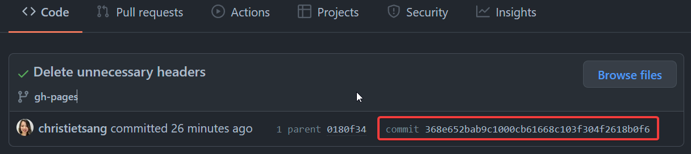

# Git Revert
{: .no_toc }

## Table of contents
{: .no_toc .text-delta }

1. TOC
{:toc}

## What is a Git Revert?

There are a number of ways to undo unintended or incorrect commits that cause something to go wrong
with your repository. The type of Git command you will use will depend on what type of data you want
to revert, and whether your commit has already been published to GitHub.

## Temporarily Switch to a Different Commit

**Purpose:** Temporarily re-visit your previous commit, do testing, make changes, and then to return
to your current commit - unaltered.

1. ***Navigate to your repository on GitHub and copy the commit ID of the commit you want re-visit.***

   
   ```bash
   $ git checkout <commit-id>
   ```
   <br/>
2. ***To return to where you were before revisiting your old commit, simply use the command line statement below.***
   ```bash
   $ git switch -
   ```
   <br/>
3. ***To check that you have correctly returned to correct version of your code, use the 
   following command line statement and cross-reference it with the most recent commit ID on GitHub.***
   ```bash
   $ git rev-parse --verify HEAD
   ```
   <br/>
## Undo Most Recent Unpublished Commit

**Purpose:** You want to undo the most recent un-pushed commit, so you can make changes before 
committing and pushing to GitHub.

1. ***To undo your last unpushed commit, use the following command line statement.***
   ```bash
   $ git reset --soft HEAD~1
   ```
   <br/>

## Delete All Unpublished Commits
**Purpose:** You want to completely remove any un-pushed changes from the local directly and 
revert the repository to the last published commit.

1. ***To completely undo any un-pushed changes, use the following command line statement.***
   ```bash
   $ git reset --hard
   ```
   <br/>

## Revert Project to a Previous Version on GitHub

1. ***Find the version you want to return to and make a record of the commit ID.***
   ```bash
   $ git log --oneline
   ```
2. ***Use the Git checkout command and the ID number of the commit you want to revert to.***
   ```bash
   $ git checkout <commit-id> .
   ```
3. ***Add your file to the staging area.***
   ```bash
   $ git add .
   ```
4. ***Commit your changes***
   ```bash
   $ git commit -m <commit message>
   ```
5. ***Push to your remote repository***
   ```bash
   $ git push
   ```


