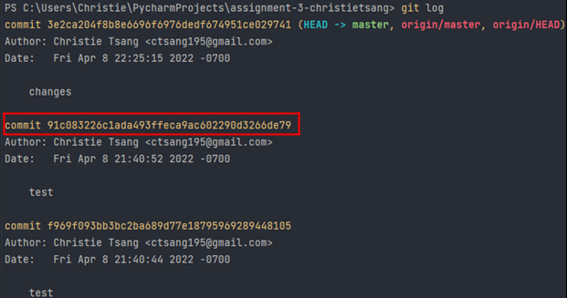

# Git Revert
{: .no_toc }

## Table of contents
{: .no_toc .text-delta }

1. TOC
{:toc}

## What is a Git Revert?

There are a number of ways to undo unintended or incorrect commits that cause something to go wrong
with your repository. The type of Git command you will use will depend on what type of data you want
to revert, and whether your commit has already been published to GitHub.

## Temporarily Switch to a Different Commit

**Purpose:** To temporarily re-visit your previous commit, do testing, make changes, and then return
to your current commit - unaltered.

1. ***Navigate to your repository on GitHub and copy the commit ID of the commit you want re-visit.***
   
   ```bash
   $ git checkout <commit-id>
   ```
   <br/>
2. ***To return to where you were before revisiting your old commit, simply use the command line statement below.***
   ```bash
   $ git switch -
   ```
   <br/>
3. ***To check that you have correctly returned to correct version of your code, use the 
   following command line statement and cross-reference it with the most recent commit ID on GitHub.***
   ```bash
   $ git rev-parse --verify HEAD
   ```
   <br/>

## Undo Most Recent Unpublished Commit

**Purpose:** You want to undo the most recent un-pushed commit, so you can make changes before 
committing and pushing to GitHub.

1. ***To undo your last unpushed commit, use the following command line statement.***
   ```bash
   $ git reset --soft HEAD~1
   ```
   <br/>

## Reverting
**Purpose:** You want to completely remove any un-pushed changes from the local directly and 
revert the repository to the last published commit.

> ⚠️ Be careful you want this is what you want, as this command  throws away all your uncommitted 
> changes.

1. ***Temporarily put away changes you've made to your files.***
   ```bash
   $ git stash
   ```
   <br/>

2. ***To completely undo any un-pushed changes, use the following command line statement.***
   ```bash
   $ git reset --hard
   ```
   <br/>

## Revert Project to a Previous Version on GitHub

1. ***Temporarily put away changes you've made to your files.***
   ```bash
   $ git stash
   ```
   <br/>

2. ***Find the version you want to return to and make a record of the commit ID.  This command 
   will return the following result in your terminal.***
   ```bash
   $ git log
   ```
   

   <br/>
   
3. ***Enter 'q' to exit before entering your next command line statement.***
   ```bash
   $ q
   ```
   <br/>

4. ***Use the Git checkout command and the ID number of the commit you want to revert to.***
   ```bash
   $ git checkout <commit-id> .
   ```
   <br/>

5. ***Create a new branch and give it a name.***
   ```bash
   $ git branch <branch-name>
   ```
   <br/>

6. ***Within <branch-name>, merge this branch with master, while discarding all changes from master 
   branch.***
   ```bash
   $ git merge -s ours master
   ```
   <br/>

7. ***Return to the master branch.***
   ```bash
   $ git checkout master
   ```
   <br/>

8. ***Merge <branch-name> with the master branch, within the master branch. If successful, you 
   will see a message similar to the picture below.***
   ```bash
   $ git merge <branch-name>
   ```
   

   <br/>

9. ***Delete the temporary branch you just created.***
   ```bash
   $ git branch -d <branch-name>
   ```

## Conclusion
By the end of this section, you will have successfully learned the following:

- [x] How to temporarily re-visit a previous commit and return to your current working directory.
- [x] How to undo your most recent unpublished commit.
- [x] How to revert your files to a previous version using Git.
